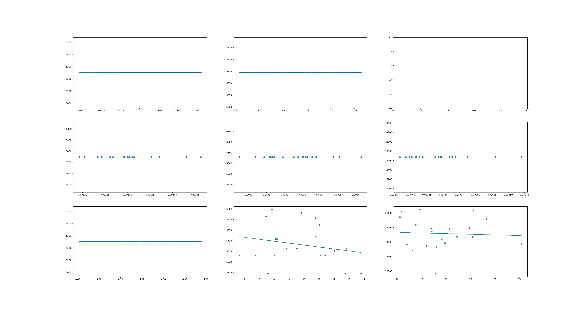
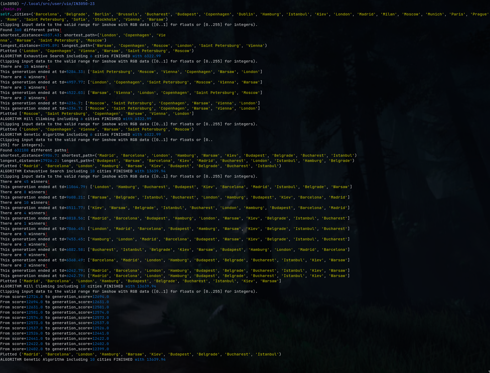

\maketitle

Most of the code for this assignment has been reused from my own delivery from last year. I've done some minor modifications, though.

I have taken an object-oriented approach because each model shares a lot of properties with the other models, and allows for easy reusability when training other datasets. Using a REPL-approach is useful for quick tests, but if I want to use this algorithms forward it's nice to have them tuck in a library I can use in other projects.

For all algorithms, I’ve run the simulations ten times, and I’ve simulated the average time for 10 cities, and 24 cities on both Hill Climbing Algorithm and the Genetic Algorithm.

{ width=130%; style="margin: auto;" }

\pagebreak

# Exhaustive search

Due to the nature of factorial growth of permutations, we can expect this number to grow by a factor of O(n!). That means I’d expect this to take `(24!/10!) * 10.53s` for all 24 cities. Sufficient to say, `10^10` years is a bit too long for my own taste.

After 20 runs, we see an an average runtime of 0.0022s(±0.0002) for 5251 meters at six cities. For 10 cities, the average distance is 5389, with 11.2s(±0.12) seconds. There is no deviation for the distance on the exhaustive search.

# Hill climbing

I was quite surprised by the effectiveness of this algorithm. Sadly it involves the issue of local maxima, resulting in imperfect runs. Regardless, the results seen are not too bad.

After 20 runs, we see an an average runtime of 0.00127(±0.0001) for 5747 meters at six cities. For 10 cities, the average distance is 6047, at 0.0032(±0.0001) seconds. For 24 cities, we see an average distance of 13670, and an average time of 0.0338s (±0.012). There is no deviation for the distance on the hill climbing algorithm.

# Genetic Algorithm

I am not sure whether I’ve managed to solve this task succesfully. Sometimes, it seems to get it right, but falls off as we increase the number of cities. I am not sure where my implementation falls apart. Tuning the values could be useful to increase its performance, presumably, but altogether I don't think that's the root of the issue.

For 6 cities, we see the same output in all cases, at 5251 distance units after 4.9(±0.02) seconds. For 10 and 24 cities, the distances become scattered, and we see an average of 5650, with a deviation of 330 units for the first case. We see that there is a decline in the distances as it runs for longer. This decline is not as apparent for 24 cities, rounding at 19373 in its distance, after running for 20 seconds on average. The standard deviation in this case is at 228 from the regression line.

Images follow.

{ width=120% }

{ width=100% }

# In general
Running the algorithm shows more detailed information of the simulation, such as scores per generation. Furthermore, the source code should be well documented, and changing the input variables for the `Salesman()` should allow for easy testing.

I would like to know how to customize my parameters more accurately, and make sure I have implemented the breeding of two parents properly. I’m not sure I fully understand how it works.

