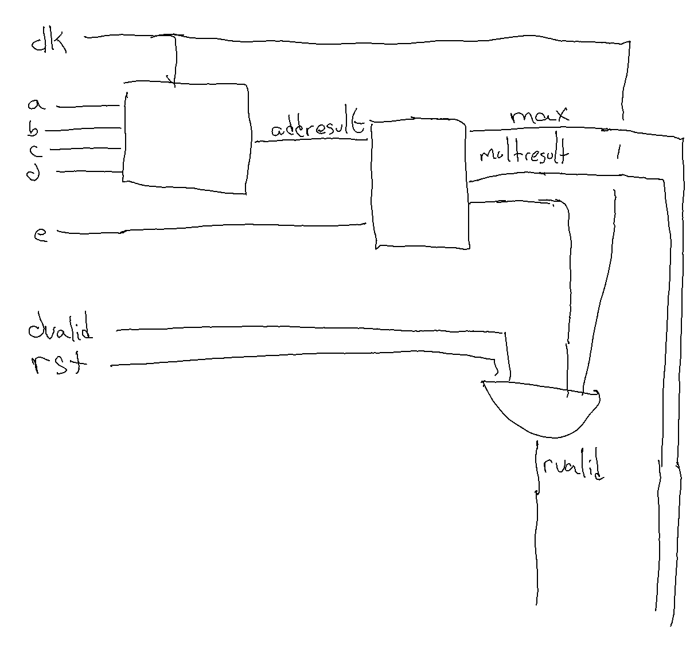
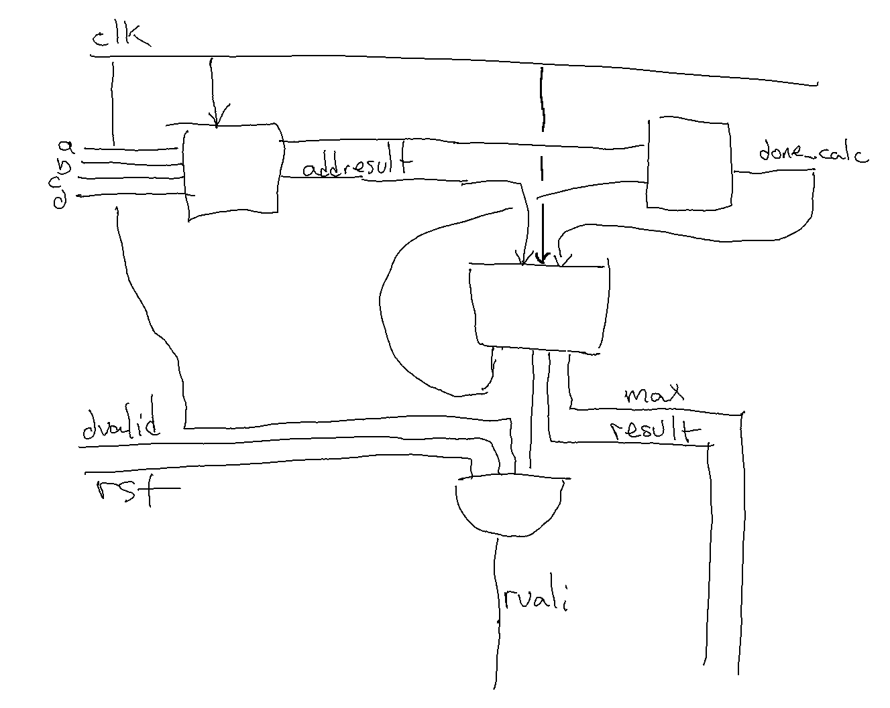

# Task 1
`(2^16 - 1) + (2^16 - 1) = 2^(16+1) - 2 < 2^17`

The answer is b.
We'd need 17 bits to avoid overflow.

# Task 2
`(2^16 - 1) * (2^16 - 1) = 2^(16+16) - 2^(16+1) + 1 < 2^32`

The answer is b.
We'd need 32 bits to avoid overflow.

# Task 3
`(2^16 - 1) + (2^16 - 1) + (2^16 - 1) + (2^16 - 1) = (2^17 - 2) + (2^17 - 2) = 2^(17+1) - 4 = 2^18 - 4 < 2^18`

The answer is c.
We'd need 18 bits to avoid overflow.

# Task 4
`(2^18 - 4) * (2^16 - 1) = 2^18 * 2^16 - 2^18 - 4*2^16 + 4 = 2^34 - 2^18 - 2^18 + 4 = 2^34 - 2^17 + 4 < 2^34`

The answer is d.
This would require 34 bits to avoid overflow.

\pagebreak

# Task 5
{ width=50% }
{ width=50% }

# Task 6
Check `compute_pipelined.vhd`. I was unable to pass the test on line 179-180: I don't quite understand where the expected value is meant to come from.

# Task 7
Because we're only assigning the signals on the rising edges, we need to store the values on the falling edges of the clock cycles, and are thus left with 32 (result) + 1 (max) + 1 (rvalid) registries.
Thus there are 34 registers (answer c).

# Task 8
The same as before, we need 34 registers because of the clockedness of the setup. Forthermore, we need 34 more registers for the `multiresult_i` values, and one for the boolean asserting whether we're calculating or assigning. In total this yields 34 + (34+1) = 69 registers (answer c).

 
